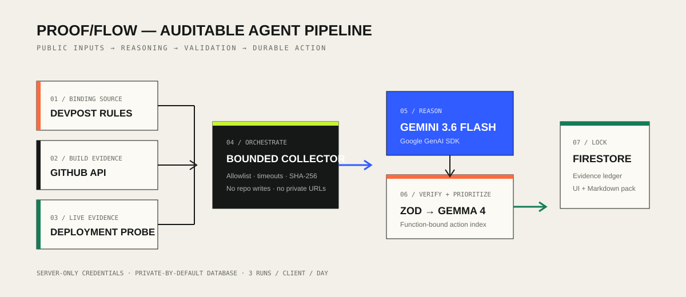

# ProofFlow Agent

ProofFlow turns binding hackathon rules and live project artifacts into a strict, judge-ready evidence ledger. It autonomously ingests an official Devpost rules page, scans a public GitHub repository, probes the deployment, asks Gemini 3.6 Flash for schema-constrained requirement reasoning, uses Gemma 4 to select one validated operational priority through a forced function call, persists the result in Firestore, and exports a portable Markdown evidence pack.

Built from scratch for the **All Things Agentic Hackathon** in the **Taskmaster** category.

## Live proof

- Submitted entry: [ProofFlow on Devpost](https://devpost.com/software/proofflow-agent)
- Product: [proofflow-agent.vercel.app](https://proofflow-agent.vercel.app)
- Public demo video (1:48): [youtu.be/kqhoyUaeGdI](https://youtu.be/kqhoyUaeGdI)
- Firestore-backed health: [proofflow-agent.vercel.app/api/health](https://proofflow-agent.vercel.app/api/health)
- Latest live audit: [JSON](https://proofflow-agent.vercel.app/api/runs/IxlFsvwqGZJ8ZHhQJ9dy) · [Markdown evidence pack](https://proofflow-agent.vercel.app/api/runs/IxlFsvwqGZJ8ZHhQJ9dy/report)
- Cloud deployment evidence: [docs/CLOUD_PROOF.md](docs/CLOUD_PROOF.md)
- Build-window provenance: [docs/BUILD_PROVENANCE.md](docs/BUILD_PROVENANCE.md)
- Gemini XPRIZE business narrative: [docs/XPRIZE_SUBMISSION.md](docs/XPRIZE_SUBMISSION.md)
- Truthful profit and loss statement: [docs/xprize-profit-and-loss.csv](docs/xprize-profit-and-loss.csv)

The public demo was created for the purposes of entering the All Things Agentic Hackathon and includes on-screen narration, a production audit, the evidence ledger, system architecture, and live Google Cloud/Firestore proof.

## Why it exists

Submission compliance is a messy, high-stakes last-mile workflow. Requirements are scattered across rules, overview pages, repository documentation, deployment dashboards, and video checklists. A generic chatbot can summarize those sources, but it does not prove which obligations are actually satisfied.

ProofFlow performs the workflow:

1. validates and fingerprints the binding rules;
2. inspects the repository tree and README through GitHub's public API;
3. probes the supplied deployment;
4. uses Gemini structured output to map requirements to concrete evidence;
5. asks Gemma 4 to select one existing next action without inventing or rewriting it;
6. records the immutable run in a private-by-default Firestore database; and
7. exposes a downloadable evidence pack with precise next actions.

Missing evidence stays missing. The model never receives credentials and the browser never receives the Gemini or Firebase keys.

## Architecture



The Next.js server runs the bounded orchestration layer. Firebase Admin access is server-only. Firestore client rules remain production-mode/private. Public usage is capped globally and per pseudonymous daily client hash.

## Sponsor technology

- **Gemini 3.6 Flash** through the official **Google GenAI SDK** (`@google/genai`), with Gemini 3.5 Flash Lite as a standards-compliant availability fallback
- **Gemma 4 26B** through the same SDK for function-bound operational prioritization; failure preserves the validated first action deterministically
- **Cloud Firestore** in the `proofflow-agent` Firebase project
- Next.js 16 and React 19 on Vercel
- Zod schema validation and Vitest

## Local spin-up

Requirements: Node.js 22 or newer, a Gemini API key, and a Firebase service-account key for a Firestore-enabled project.

```bash
npm install
cp .env.example .env.local
```

Set:

- `GEMINI_API_KEY` to a server-only Gemini API key;
- `FIREBASE_SERVICE_ACCOUNT_BASE64` to the base64-encoded service-account JSON; and
- `RATE_LIMIT_SECRET` to a long random value.

Then run:

```bash
npm test
npm run dev
```

Open `http://localhost:3000`. The default inputs point to this project's contest rules and public repository.

## Production deployment

1. Create a Vercel project from this repository.
2. Add the three server-only environment variables listed above.
3. Deploy the `main` branch.
4. Call `GET /api/health` and confirm both `ok` and `firestore`.
5. Run one audit through the UI and download `/api/runs/{id}/report`.

Never commit the service-account JSON or expose it through a `NEXT_PUBLIC_` variable.

## API

`POST /api/analyze`

```json
{
  "rulesUrl": "https://allthingsagentichackathon.devpost.com/rules",
  "repoUrl": "https://github.com/ArgonautWorks/proofflow-agent",
  "projectUrl": "https://proofflow-agent.vercel.app"
}
```

Other routes:

- `GET /api/runs/{id}` — retrieve a persisted audit;
- `GET /api/runs/{id}/report` — download its Markdown evidence pack; and
- `GET /api/health` — verify the server and Firestore path.

## Paid agent API

The free UI remains available for evaluation. Autonomous buyers can request higher-priority machine-readable audits through `POST /api/v1/audits` for **$0.05 USDC on Base** using x402 v2. The paid handler validates the sources, checks capacity, and completes model inference before settlement; invalid inputs, capacity failures, and upstream model errors are not charged. `GET /api/v1/audits` returns free machine-readable purchase instructions; only `POST` is paid.

Discovery is available at `/openapi.json`, `/.well-known/x402`, and `/llms.txt`. Payments settle directly to the ArgonautWorks receiving wallet without an account, subscription, or API key.

The public origin also exposes `/robots.txt` and `/sitemap.xml`. Significant landing-page changes can be submitted to participating search engines with `npm run notify:indexnow`; the notifier first verifies the deployed ownership key and never treats an accepted indexing request as traffic or revenue.

Free agent discovery is also available at `/.well-known/agent-card.json` and `POST /a2a`. The A2A transport returns purchase instructions only: it never invokes Gemini, creates an audit, or initiates payment.

- [x402scan service page](https://www.x402scan.com/server/0cd77797-74c0-4dfa-a7f4-047ce5c35afb)
- [PayanAgent relay offer](https://payanagent.com/x402/kh78bdhmjvfteqqpfq06e5g3g98bw5ks)
- [Agent Tools paid-service card](https://agent-tools.cloud/services/proofflow-agent-vercel-app-sub180)
- [Agent Tools A2A card](https://agent-tools.cloud/a2a/agents/argonautworks-proofflow-audit-api)
- [A2A Registry verified agent](https://a2aregistry.org/api/agents/5e987ee5-1f3d-430e-a3c6-5abc940d1ea0)

Directory records and unpaid challenge probes are distribution evidence, not revenue.

As of the XPRIZE submission package on August 5, 2026, ProofFlow has recorded no external users, paying users, revenue, or expenses. Internal tests, operator runs, directory probes, and judging activity are excluded from those figures. The public P&L above is the canonical disclosure until independently settled revenue is observed.

## Guardrails

- official Devpost rules pages and public GitHub repository roots only;
- Vercel or Devpost deployment probes only;
- no arbitrary URL fetching, repository writes, or user-supplied prompts;
- strict request size and daily capacity limits;
- primary model output constrained by JSON Schema and revalidated with Zod;
- Gemma can select only an existing validated action index through a forced function call; and
- no raw client IP storage.

## License

Apache-2.0
